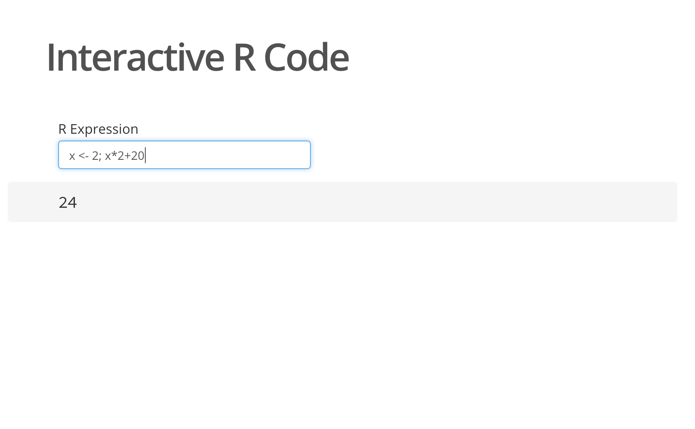
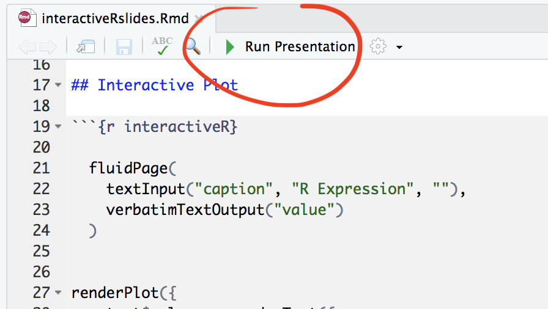

IOSlides + Shiny = interactive R code in presentations
=======

What is this?
-------------

Here is a little demo that show how with only few lines of code we can
combine the IOSlides presentation framework and Shiny to create
presentations, in which we can online evaluate R code. This seems
particularly useful for teaching because there is no need to switch to an R
interpreter during a presentation. Here is how your presentation with an
interactive R input box may look:

Usage
------------
Download the repository, open the `ìnteractiveRslides.Rmd` in RStudio and hit the 'Run
Presentation' button.

Then, go to slide 3 and enter some R code into the textbox. If all goes
well, the return value of the evaluated expression will be output to the slide.
